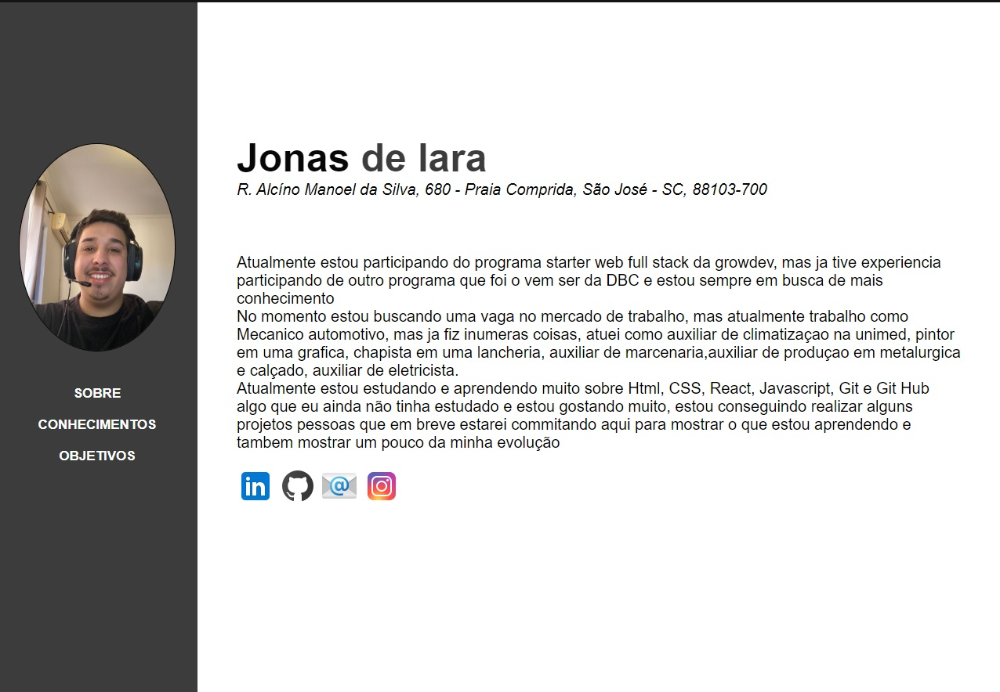
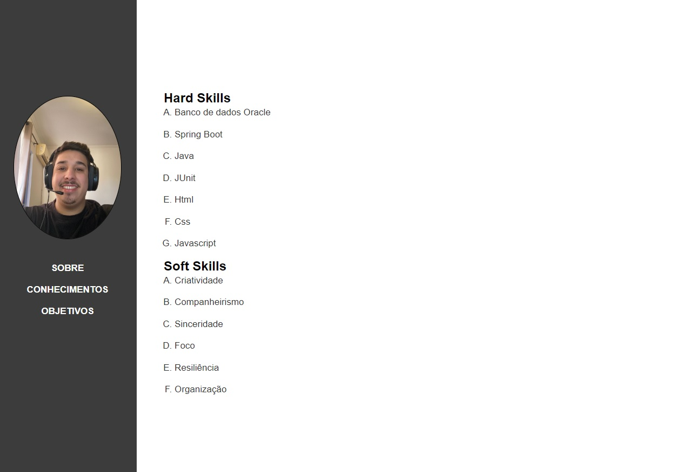
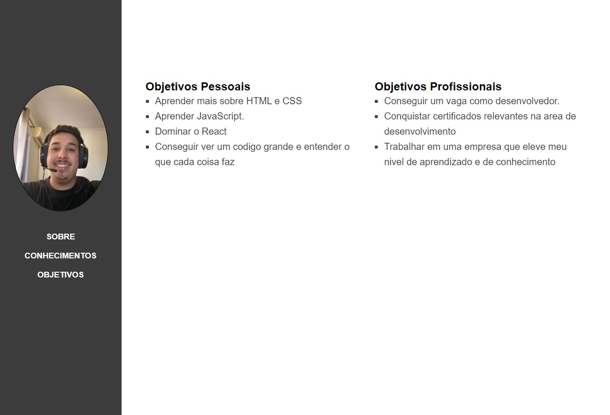

<h1>Avaliação Final - Front-End I</h1>

 O programa consiste em 3 páginas html sendo elas 
- index.html
- conhecimentos.html
- objetivos.html

 

1 pasta de css com os styles salvos em:
- styles.css

 

 <h2>Página Index</h2>
 
 
 
  <h2>Página Conhecimentos</h2>
  

   
  
  <h2>Página Objetivos</h2>
  
